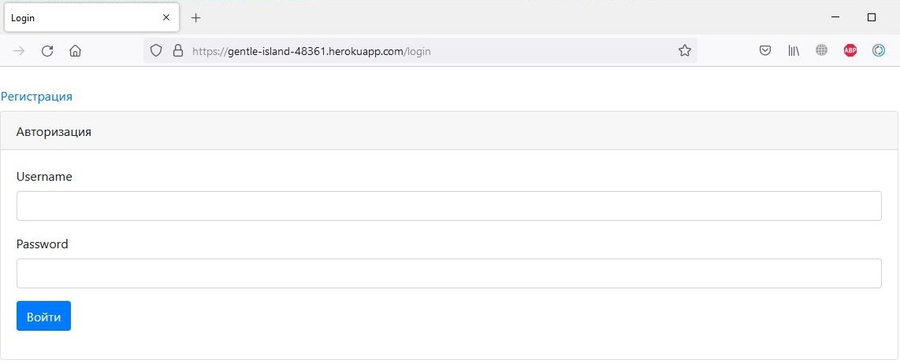

## Описание
Веб приложение, реализующее функционал интернет форума. Позволяет создавать темы для обсуждения и оставлять комментарии. 

Приложение развернуто на heroku 

## Технологии
* Java 14
* PostgreSQL
* Hibernate
* Spring Boot 2
* Spring Data JPA
* Spring Security

## Использование
При старте приложения необходимо ввести логин и пароль или зарегистрироваться.

После регистрации пользователь попадает на главную страницу со списком всех существующих тем.

Пользователь может создавать свои темы и редактировать их

В открытой теме пользователь может добавлять комментарии

